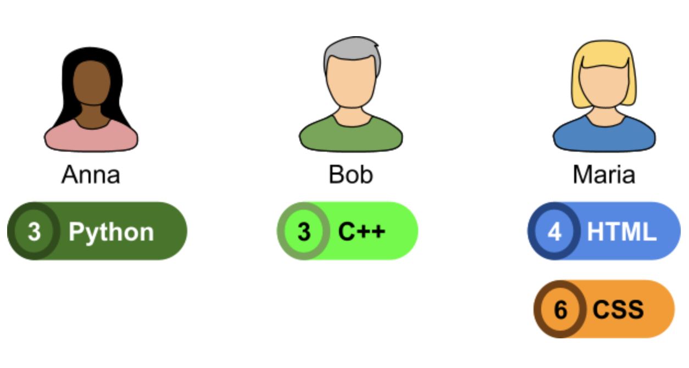

# Answer for - Mentorship and Teamwork
 Google Hash Code '22 Question

# Creadit goes to Google LLC - Hash Code '22

Work is so much more fun when we are part of a team! By combining our different skills, 
we can be more creative, efficient and productive. And more importantly, when working together 
we share... not only pizzas, but also knowledge. We can learn from each other, improve our own 
skills and gain experience.  
Teamwork is one of the main ingredients of Hash Code, especially in this challenge!  
So, are you up for the challenge?  
  
## Summary
You are given a list of contributors, who have already mastered various skills, and a list 
of projects with different skill requirements. Contributors can improve their skills by 
completing projects and can mentor each other to work is roles in which they couldn't succeed 
on their own.  
Your task is to assign contributors to project roles that fit their qualifications and maximize 
the score for completed projects.

### Problem description
#### Contributors
There are N contributors. 
Each contributor has a name and one or more skills at a specific level (0,1,2,...). 
Not possessing a skill is equivalent to possessing a skill at level 0.  
  
For example, three contributors could have the following skills:
  
Anna: Python level 3  
Bob: C++ level 3  
Maria: HTML level 4, CSS level 6  
  
  

#### Projects
There are M projects. Each project is described by:  
1. its name  
2. the duration of the project in days (how long it takes to complete a project once it is started)  
3. the score awarded for completing the project  
4. the “best before” time in days – if the project last day of work is strictly 
before the indicated day, it earns the full score. 
If it’s late (that is, the project is still worked on during or after its "best before day"), 
it gets one point less for each day it is late, but no less than zero points. 
See also the example in the "Assignments" section below.  
5. a list of roles for contributors working on the project  

Each project has one or more roles that need to be filled by contributors. 
Each role requires one skill at a specific level, and can be filled by a single contributor. 
Each contributor can fill **at most one role** on a single project.
  
  
For example, a project called "WebServer" could have the following roles:  
  
* Role 0 requiring Python level 3  
* Role 1 requiring HTML level 1  
* Role 2 requiring CSS level 5  

  

#### Filling roles and mentorship
A contributor can be assigned to a project for a specific role 
(at most one role in a single project), if they either:  

1. have the skill at the required level or higher; or
2. have the skill at exactly one level below the required level, **only if another contributor 
on the same project (assigned to another role), has this skill at the required level or higher.**
In this case, the contributor will be mentored by their colleague :)
  
One contributor can mentor multiple people at once, 
including for the same skill. A contributor can mentor and be mentored by other contributors 
at the same time.  
  
Not possessing a skill is equivalent to possessing a skill at level 0. 
So a contributor can work on a project and be assigned to a role with requirement 
C++ level 1 if they don’t know any C++, provided that somebody 
else on the team **knows C++ at level 1 or higher.**  
  
  
For example:  

For the project WebServer above we could make the following assignments:  
  
Role 0 (requires Python level 3) is assigned to Anna (Python level 3).  
  
☑️ Anna has the same level in Python as required.  
Role 1 (requires HTML level 1) is assigned to Bob (C++ level 3).  
  
⚠ Bob has level 0 in HTML. Since his level is only one below required, he can be assigned, 
but must be mentored by another contributor who knows HTML at level 1 or above.  
Role 2 (requires CSS level 5) is assigned to Maria (HTML level 4, CSS level 6)  
  
☑️ Maria has a higher level than the one required for CSS.  
☑️ Maria can mentor Bob on HTML since she has HTML level 4.  

#### Assignments
Each contributor can start working on day 0 and can be working on at most one project at the 
same time. Once the work on a project starts, its contributors will be working on it the number 
of days equal to its duration and then become available to work on other projects.  
  
For example, if the project WebServer has duration of 7 days and starts on day 0, the contributors 
assigned to it will be working on it during: day 0, day 1, day 2, day 3, day 4, day 5 and day 6. 
On day 7 the project is already completed. Contributors assigned to it can work on another project 
on day 7.  

#### Learning
Completing a project is a learning opportunity, especially for the contributors working on the 
edge of their existing abilities! When each project is completed:  
  
* contributors working in roles where the required skill level was equal or higher than their 
current level improve their skill level by one level  
* other contributors keep their skill level
  
Note that **mentoring** someone doesn’t increase the level of the skill for the mentor.

For example:  
  
In the assignments above:  
  
Anna improves Python skill to level 4;  
Bob improves HTML skill to level 1;  
Maria improves neither the CSS skill (because Maria’s CSS is already at a level higher than required) 
nor the HTML skill (because her role required CSS, not HTML).  

### Input data sets
a. 
b. 
c. 
d. 
e. 
f. 

### File format
Each input data set is provided in a plain text file. 
The file contains only ASCII characters with lines ending with a single '\n' character 
(also called “UNIX-style” line endings). When multiple strings and numbers are given in one line, 
they are separated by a single space between each two elements.
  
The first line of the data set contains:  
  
* an integer C (1 ≤ C≤ 105) – the number of contributors,  
* an integer P (1 ≤ P ≤ 105) – the number of projects.  
  
This is followed by C sections describing individual contributors. 
Each contributor is described by the following lines:  
  
* the first line contains:  
1. the contributor's name (ASCII string of at most 20 characters, all of which are lowercase or 
uppercase English alphabet letters a-z and A-Z, or numbers 0-9),
2. an integer N (1≤ N ≤ 100) - the number of skills of the contributor.

* the next N lines describe individual skills of the contributor. Each such line contains:  
1. the name of the skill (ASCII string of at most 20 characters, all of which are lowercase or 
uppercase English alphabet letters a-z and A-Z, numbers 0-9, dashes '-' or pluses '+'),
2. an integer Li (1≤ Li ≤ 10) - skill level.
  
This is followed by P sections describing individual projects. 
Each project is described by the following lines:  
  
* the first line contains:  
1. the name of the project (ASCII string of at most 20 characters, all of which are lowercase or uppercase English alphabet letters a-z and A-Z or numbers 0-9),
2. an integer Di (1 ≤Di ≤ 105) – the number of days it takes to complete the project,
3. an integer Si (1 ≤ Si ≤ 105) – the score awarded for project’s completion,
4. an integer Bi (1 ≤ Bi ≤ 105) – the “best before” day for the project,
5. an integer Ri (1 ≤ Ri ≤ 100) – the number of roles in the project.

* the next Ri lines describe the skills in the project:
1. a string Xk – the name of the skill (ASCII string of at most 20 characters, 
all of which are lowercase or uppercase English alphabet letters a-z and A-Z, 
numbers 0-9, dashes '-' or pluses '+'),
2. an integer Lk (1≤Lk≤100) – the required skill level.
  
  
### Example
  
  

### Submissions
The submission file should be a plaintext file containing only ASCII characters.  

### File format
Your submission describes which projects each contributor is going to work on and in which role.  

The first line should contain the integer E (0≤E≤P) – the number of executed projects.  

This should be followed by E sections each describing one completed project. 
Each project should be described by two lines:  

1. A single line containing the name of the project (as it appears in the input file). 
Each project can be mentioned at most once in the submission file.
2. A single line containing the names of the contributors assigned to each of the project roles, 
separated by single spaces and listed in the same order as the roles appear in the input file.
  
  

### Scoring
Each contributor can only work on one project at a time. 
If one contributor is assigned to multiple projects, the contributor will work on them in the 
same order as they appear in the submission file. Each project starts immediately on the first 
day on which all the assigned contributors are available.

 

If some project assignment is invalid because the assigned contributor does not have 
the required skill level for the project after finishing all previously assigned projects, 
the submission is considered invalid and will not be scored.  
  
Each project that is completed successfully receives its assigned score, as defined in the 
input file, minus penalty points for any delay. If a project is completed after its 
“best before” time, it gets one point less for each day it is late (but no less than zero points). 
Note that even if a project scores zero points, the assigned contributors will work on it 
(and may improve their skills thanks to it).  
  
The total score is the sum of scores for all correctly completed projects.  
  
The **example** submission results in this timeline:  

**Day 0 to day 6** : Bob and Anna are working on project **WebServer** (they both have the 
skills required).  
1. As of project completion, Anna levels up in C++: level 2 → 3;
2. Bob doesn't level up because his HTML skill (level 5) is of a higher level than required 
for the project (level 3).
  
Project WebServer's last day of work is day 6, so it completes strictly before its 
"best before" day 7 and receives the full score: **10 points** .
  
**Day 7 to 11** : Anna is working on the project Logging (she has sufficient C++ skill after 
completing project WebServer).  
1. As of project completion, Anna levels up in C++: level 3 → 4;
  
  
Project Logging's last day of work is 11 (so it's completed strictly before day 12), 
while its "best before" day was 5. It is late by (12−5=) 7 days and receives a score of: 
(10−7=) **3 points.**  
  

**Day 7 to 16** : Maria and Bob are working on project **WebChat** (Maria is mentoring Bob in 
Python to reach requirement of level 1, Bob is mentoring Maria in HTML to reach requirement 
of level 1)  

1. As of project completion, Maria learns HTML to level 1 and levels up in Python: level 3 → 4;
2. Bob learns Python to level 1 and doesn't level up in HTML because his skills are of a higher 
level than required for the project (HTML level 5, required 3)  
  
Project WebChat's last day of work is day 16, while the "best before" day is 20, so it receives 
the full score: **20 points.**

In the end, projects Webserver ( **10 points** ), Logging ( **3 points** ) and WebChat ( **20 points** ) 
are completed, resulting in a total score of **33 points.**  
  
**Note that there are multiple data sets representing separate instances of the problem. 
The final score for your team will be the sum of your best scores for the individual data sets.**

